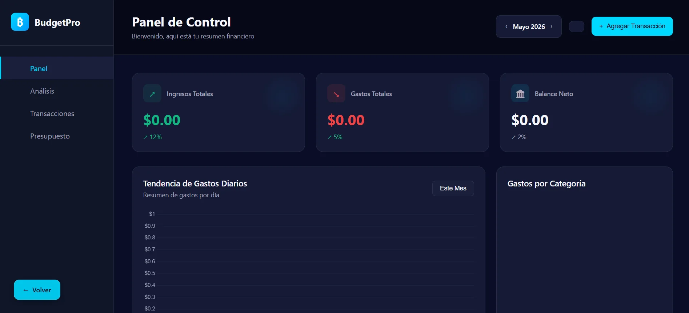
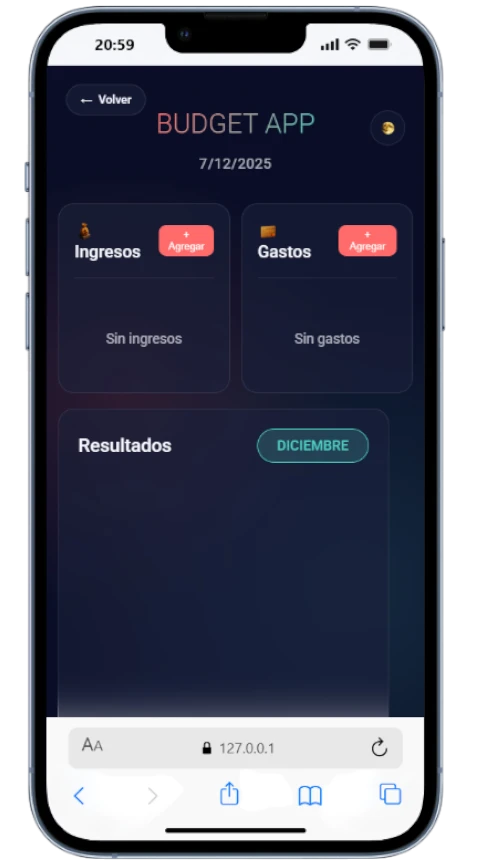

# Budget App v1.0

Dashboard financiero personal construido con JavaScript vanilla, Chart.js y localStorage — sin frameworks, sin dependencias de backend.


## 🎯 Características

- Agregar y eliminar transacciones (ingresos y gastos)
- Cálculo automático de ingresos totales, gastos y balance neto
- Gráfico de barras con tendencia de gastos diarios (Chart.js)
- Desglose de gastos por categoría con barras de progreso
- Historial de transacciones recientes con íconos por categoría
- Navegación por mes (meses anteriores y futuros)
- Persistencia completa en `localStorage` — los datos no se pierden al recargar
- UI dark mode con sidebar fijo, responsive en mobile

## 🚀 Demo

🔗 **[Ver Demo en Vivo](https://risso-patron.com/budget-app/)**

## 📸 Capturas




## 🛠️ Tecnologías

| Tecnología | Uso |
|---|---|
| HTML5 / CSS3 | Estructura y estilos (todo inline, sin archivos externos) |
| JavaScript ES6 | Lógica de la app, DOM manipulation, eventos |
| Chart.js 4.4 | Gráfico de barras de gastos diarios |
| localStorage | Persistencia de transacciones entre sesiones |

## 💡 Uso

1. Abre la app desde el demo en vivo o clónalo localmente
2. Haz clic en **"Agregar Transacción"** para registrar un ingreso o gasto
3. Selecciona tipo, monto, categoría y fecha
4. El dashboard se actualiza automáticamente — stats, gráfico y lista de transacciones
5. Navega entre meses con las flechas `‹ ›` del encabezado

## 🎓 Aprendizajes

Construir esto me enseñó:

- **DOM manipulation sin frameworks**: actualizar el UI reactivamente con JS puro requiere más disciplina que React — fue una lección valiosa
- **Chart.js API**: configurar escalas, tooltips personalizados y re-renderizar el canvas al cambiar de mes
- **localStorage como base de datos**: serializar/deserializar JSON, filtrar por mes en el cliente, manejar el caso "no hay datos"
- **CSS Variables para theming**: todo el sistema de colores en `:root`, sin hardcodear valores
- **Por qué existen los frameworks**: después de terminar esto entendí qué problema resuelve React — y fue la motivación para construir la [v2.0](https://budget-calculator-rp.netlify.app)

## 🔮 Evolución — v2.0

Esta app evolucionó a **Budget Calculator v2.0**, reconstruida en React + Supabase:

- Autenticación de usuarios
- Sincronización multi-dispositivo en tiempo real
- Arquitectura de componentes reutilizables
- PostgreSQL como base de datos real

🔗 [Ver Budget Calculator v2.0](https://budget-calculator-rp.netlify.app) · [Ver código v2.0](https://github.com/risso-patron/budget-calculator-react)

## 📦 Instalación local

```bash
git clone https://github.com/risso-patron/portfolio.git
cd portfolio

# Servir con cualquier servidor estático
python -m http.server 8000
# Luego abre: http://localhost:8000/budget-app/
```

No requiere `npm install` ni configuración — vanilla JS puro.

## 👤 Autor

**Jorge Luis Risso Patrón**
- GitHub: [@risso-patron](https://github.com/risso-patron)
- Portfolio: [risso-patron.com](https://risso-patron.com)

## 📄 Licencia

MIT License
