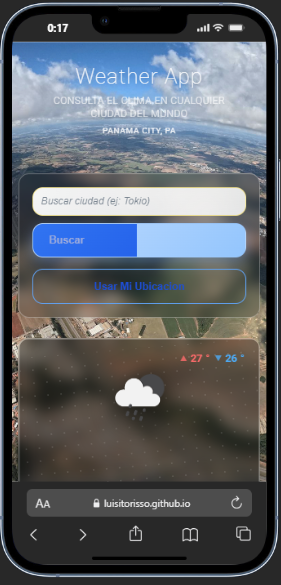

# 🌤️ Weather App

**App del clima con geolocalización y pronóstico de 5 días**



<div align="center">

[](https://developer.mozilla.org/docs/Web/HTML)
[](https://developer.mozilla.org/docs/Web/CSS)
[](https://developer.mozilla.org/docs/Web/JavaScript)
[](https://openweathermap.org/api)

🔗 **[Ver Demo en Vivo](https://luisitorisso.github.io/Luisitorisso/weather-app/)** | 📱 **[Probar Ahora](https://jorge-luis-risso-patron-dev.netlify.app/weather-app/)**

</div>

---

## 🎯 Características

- **🔍 Búsqueda por ciudad**: Busca el clima de cualquier ciudad del mundo
- **📍 Geolocalización**: Detecta automáticamente tu ubicación actual
- **🌡️ Información completa**: Temperatura, sensación térmica, humedad, viento, presión
- **📅 Pronóstico 5 días**: Predicción del clima para los próximos días
- **🌓 Conversión de unidades**: Cambia entre Celsius y Fahrenheit
- **📱 100% Responsive**: Optimizado para TODOS los dispositivos
  - 📱 Móviles (iPhone SE, 12, 13, 14, 15, 16, Android)
  - 📱 Orientación landscape móvil
  - 📲 Tablets (iPad, iPad Pro 11", iPad Pro 12.9")
  - 💻 Laptops (1366px - 1440px)
  - 🖥️ Desktop 2K/QHD (1440px - 1920px)
  - 📺 Smart TV Full HD (1920px - 3840px)
  - 📺 TV 4K Ultra HD (3840px+)
- **👆 Touch-optimized**: Botones y controles de 44px+ para dispositivos táctiles
- **⚡ Sin dependencias**: JavaScript vanilla puro

---

## � Más Capturas

### 🖥️ Desktop


### 📱 Mobile


---

## 🛠️ Tecnologías Utilizadas

### Frontend
- **HTML5**: Estructura semántica y accesible
- **CSS3**: 
  - Variables CSS para theming
  - Grid y Flexbox para layouts
  - Animaciones suaves
  - **Responsive Design Mobile-First + TV Support**:
    - 📺 TV 4K Ultra HD (3840px+)
    - 📺 TV Full HD (1920px - 3839px)
    - 🖥️ Desktop 2K (1440px - 1919px)
    - 💻 Laptop L (1366px - 1439px)
    - 📲 iPad Pro (1025px - 1365px)
    - 📱 Tablets landscape
    - 📱 Mobile landscape (896px)
    - 📱 iPhone 12/13/14 (376px - 430px)
    - 📱 iPhone SE (max 375px)
  - Touch device optimization (@media hover: none)
  - Reduced motion support (@media prefers-reduced-motion)
- **JavaScript ES6+**:
  - Fetch API para requests HTTP
  - Async/await para operaciones asíncronas
  - Geolocation API
  - LocalStorage (preparado para favoritos)

### API
- **OpenWeatherMap API**: Datos meteorológicos en tiempo real

---

## 💡 Uso

### 1. Buscar por Ciudad
1. Escribe el nombre de una ciudad en el campo de búsqueda
2. Presiona "Buscar" o Enter
3. Ve la información actual y pronóstico de 5 días

### 2. Usar Geolocalización
1. Click en "📍 Usar Mi Ubicación"
2. Permite el acceso a la ubicación cuando el navegador lo solicite
3. La app detectará automáticamente tu ciudad

### 3. Cambiar Unidades
- Click en **°C** para Celsius
- Click en **°F** para Fahrenheit

---

## 🔧 Configuración (API Key)

### Paso 1: Obtener API Key Gratuita

1. Ve a [OpenWeatherMap](https://openweathermap.org/api)
2. Crea una cuenta gratuita
3. Ve a tu dashboard y copia tu API key
4. Plan gratuito incluye **1,000 llamadas/día** (más que suficiente)

### Paso 2: Configurar la App

1. Abre `index.html` en un editor de código
2. Busca la línea: `const API_KEY = 'TU_API_KEY_AQUI';`
3. Reemplaza `TU_API_KEY_AQUI` con tu API key real:
   ```javascript
   const API_KEY = 'tu_api_key_real_aqui';
   ```
4. Guarda el archivo

### Paso 3: Ejecutar

#### Opción A: Servidor Local
```bash
# Usando Python
python -m http.server 8000

# Usando Node.js
npx serve .

# Usando PHP
php -S localhost:8000
```

#### Opción B: Abrir Directamente
- Simplemente abre `index.html` en tu navegador
- ⚠️ Algunas features (geolocalización) requieren HTTPS en producción

---

## 📦 Instalación

```bash
# Clonar el repositorio
git clone https://github.com/Luisitorisso/Luisitorisso.git

# Navegar a la carpeta
cd Luisitorisso/weather-app

# Configurar API key (ver sección anterior)
# Editar index.html con tu API key

# Ejecutar en servidor local
python -m http.server 8000

# Abrir en navegador
# http://localhost:8000
```

---

## 🎓 Aprendizajes

Lo que aprendí construyendo esta Weather App:

### 🔧 Técnico
- **Integración de APIs**: Manejo de OpenWeatherMap API con autenticación
- **Async JavaScript**: Uso de async/await para operaciones asíncronas
- **Error Handling**: Manejo elegante de errores de red y permisos
- **Geolocation API**: Implementación de ubicación automática
- **Responsive CSS**: Grid y Flexbox para layouts adaptativos

### 🎨 Diseño
- **UX/UI Principles**: Indicadores de loading, estados de error claros
- **CSS Moderno**: Variables CSS, animaciones sutiles, gradientes
- **Mobile-First**: Diseño pensado primero para móviles
- **Iconografía**: Uso efectivo de emojis como iconos del clima

### 🔍 Debugging
- **DevTools**: Debugging de requests API y errores de red
- **Cross-browser**: Testing en diferentes navegadores
- **Performance**: Optimización de requests y rendering

---

## � Arquitectura Responsive

La app implementa un sistema **Mobile First + TV Support** con 10+ breakpoints optimizados:

### Breakpoints Implementados

| Dispositivo | Rango | Grid Columnas | Tamaño Fuente Principal | Ícono Clima |
|-------------|-------|---------------|-------------------------|-------------|
| 📺 **TV 4K Ultra HD** | 3840px+ | 4-5 columnas | 20rem | 600px |
| 📺 **TV Full HD** | 1920px - 3839px | 4-5 columnas | 12rem | 400px |
| 🖥️ **Desktop 2K** | 1440px - 1919px | 4-5 columnas | 9rem | 300px |
| 💻 **Laptop L** | 1366px - 1439px | 4-5 columnas | 8rem | 280px |
| 📲 **iPad Pro 12.9"** | 1025px - 1365px | 3-4 columnas | 7rem | 250px |
| 📱 **Tablet Landscape** | 768px - 1024px (landscape) | 3-4 columnas | 6rem | 200px |
| 📱 **Tablet Portrait** | max 1024px | 2 columnas | 2.5rem | 180px |
| 📱 **Mobile Landscape** | max 896px (landscape) | 4-5 columnas | 4rem | 120px |
| 📱 **iPhone 12/13/14** | 376px - 430px | 2 columnas | 4.5-5rem | 130-150px |
| 📱 **iPhone SE** | max 375px | 1-2 columnas | 3.5rem | 100px |

### Optimizaciones Específicas

#### 📺 Pantallas Grandes (TV/Desktop)
- **Container max-width**: 1600px - 3200px
- **Typography**: Font-size 8rem - 20rem para títulos
- **Grid layouts**: 4-5 columnas en weather details y forecast
- **Icons**: Escalados hasta 600px en 4K
- **Spacing**: Padding/gap 2rem - 6rem

#### 📲 Tablets
- **iPad Pro optimización**: Grid 3 columnas, iconos 250px
- **Landscape mode**: Layout horizontal con search inline
- **Touch targets**: Mínimo 44px × 44px
- **Grid adaptativos**: 3-4 columnas según orientación

#### 📱 Móviles
- **Grid responsive**: 1-2 columnas en portrait
- **Landscape optimization**: 4-5 columnas para aprovechar ancho
- **Typography scaling**: clamp() para texto fluido
- **Touch interactions**: Botones 44px+, sin hover effects
- **Performance**: Animaciones reducidas (@media prefers-reduced-motion)

### Técnicas CSS Utilizadas

```css
/* Tipografía fluida con clamp() */
font-size: clamp(1.3rem, 7vw, 1.75rem);

/* Grid responsive automático */
grid-template-columns: repeat(auto-fit, minmax(200px, 1fr));

/* Touch device detection */
@media (hover: none) and (pointer: coarse) {
  button { min-height: 44px; min-width: 44px; }
}

/* Orientation queries */
@media (orientation: landscape) { /* ... */ }

/* Reduced motion support */
@media (prefers-reduced-motion: reduce) {
  * { animation-duration: 0.01ms !important; }
}
```

### Testeo de Dispositivos

✅ **Testeado en**:
- Chrome DevTools (todos los presets)
- Firefox Responsive Design Mode
- Real devices: iPhone, iPad, Android phones
- Desktop: 1920×1080, 2560×1440, 3840×2160

🔧 **Herramientas de testing recomendadas**:
- Chrome DevTools (F12 → Toggle device toolbar)
- [Responsively App](https://responsively.app/)
- [BrowserStack](https://www.browserstack.com/)

---

## �🔮 Próximas Mejoras

- [ ] **Favoritos**: Guardar ciudades favoritas en LocalStorage
- [ ] **Gráficos**: Visualización de temperatura con Chart.js
- [ ] **Notificaciones**: Alertas meteorológicas push
- [ ] **Mapa**: Integración con mapas interactivos
- [ ] **Historial**: Ver clima de días anteriores
- [ ] **PWA**: Convertir en Progressive Web App
- [ ] **Dark Mode**: Tema oscuro/claro
- [ ] **Idiomas**: Soporte multiidioma

---

## 🚨 Solución de Problemas

### Error: "API Key no configurada"
- Asegúrate de haber reemplazado `TU_API_KEY_AQUI` con tu API key real

### Error: "Ciudad no encontrada"
- Verifica la ortografía del nombre de la ciudad
- Intenta con nombres en inglés (ej: "Panama City" en lugar de "Ciudad de Panamá")

### Error: "Permiso de ubicación denegado"
- En tu navegador, permite el acceso a la ubicación
- En Chrome: Click en el ícono de candado → Ubicación → Permitir

### La app no carga en GitHub Pages
- GitHub Pages requiere HTTPS
- La geolocalización puede no funcionar sin HTTPS

---

## 🌐 Browser Support

| Navegador | Versión Mínima | Notas |
|-----------|----------------|-------|
| Chrome | 60+ | ✅ Completamente soportado |
| Firefox | 55+ | ✅ Completamente soportado |
| Safari | 11+ | ⚠️ Backdrop-filter limitado |
| Edge | 79+ | ✅ Completamente soportado |

---

## 📊 Estructura del Proyecto

```
weather-app/
├── index.html              # App principal (HTML + CSS + JS)
├── README.md              # Esta documentación
└── screenshots/           # Capturas para el README
    ├── desktop-view.png
    └── mobile-view.png
```

---

## 🔐 Seguridad

### API Key
- ⚠️ **La API key está expuesta** en el frontend (normal para demos)
- 🔒 **Para producción**: Usa un backend proxy para ocultar la API key
- 📊 **Límites**: El plan gratuito tiene 1,000 requests/día

### CORS
- ✅ OpenWeatherMap permite requests desde navegadores
- ✅ No hay problemas de CORS en esta implementación

---

## 👤 Autor

**Jorge Luis Risso Patrón**
- GitHub: [@Luisitorisso](https://github.com/Luisitorisso)
- Portfolio: [luisitorisso.github.io/Luisitorisso](https://luisitorisso.github.io/Luisitorisso/)
- Email: [luisrissopa@gmail.com](mailto:luisrissopa@gmail.com)
- WhatsApp: [+507 6456-0263](https://wa.me/50764560263)
- Ubicación: Ciudad de Panamá, PA 🇵🇦

---

## 📄 Licencia

MIT License - Siéntete libre de usar este código para tus propios proyectos.

---

## 🤝 Contribuir

¿Encontraste un bug o tienes una idea para mejorar la app?

1. Fork el repositorio
2. Crea una rama para tu feature (`git checkout -b feature/nueva-caracteristica`)
3. Commit tus cambios (`git commit -m 'Agregar nueva característica'`)
4. Push a la rama (`git push origin feature/nueva-caracteristica`)
5. Abre un Pull Request

---

## ⭐ Reconocimientos

- **OpenWeatherMap**: Por la excelente API gratuita
- **Google Fonts**: Por las fuentes web
- **CSS Grid Garden**: Inspiración para layouts responsive
- **JavaScript.info**: Referencia para async/await patterns

---

<div align="center">

### 🌟 ¿Te gustó este proyecto?

[](https://github.com/Luisitorisso/Luisitorisso)
[](https://github.com/Luisitorisso/Luisitorisso/fork)

**¡Dale una ⭐ al repo si te fue útil!**

</div>

---

<sub>**Creado con ❤️ por Jorge Luis Risso Patrón | Desarrollador Frontend Junior**</sub>